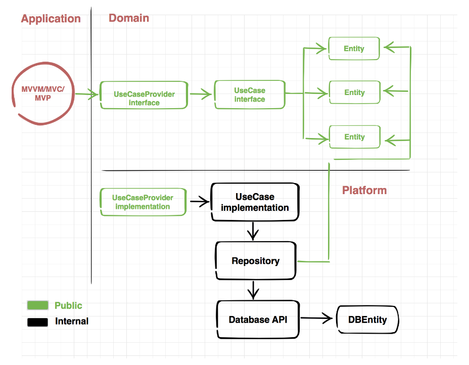
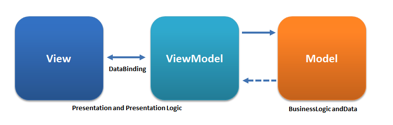

# Map_Sample

## Concept

### Domain

Domian은 앱에서 어떤 기능을 갖고 어떤 일들을 할 지 정의하는 곳이다. 

###### Entities

앱에서 사용 될 데이터들을 정의한다.

~~~swift
public struct Place: Codable {
    public var placeName   : String //장소명, 업체명
    public var distance    : String  //중심좌표까지의 거리
    public var categoryName: String //카테고리 이름
    public var addressName: String //전체 지번 주소
    public var roadAddressName: String //전체 도로명 주소
    public var id: String //장소 id
    public var phone: String //전화번호
    public let categoryGroupCode: CategoryCode//카테고리 그룹 코드
    public var categoryGroupName: String//카테고리 그룹 명
    public let x: String //장소 x좌표
    public let y: String //장소 y좌표
}
~~~

###### UseCases

앱에서 어떤 것들을 할 지 정의한다.

~~~swift
public protocol FindPlaceUseCase {
    func findPlaceBy(categoryCode:CategoryCode,
                     position: Position,
                     radius:Int,
                     page: Int ,
                     size: Int) -> Observable<FindPlaces>
}
~~~

### Platform

Platform은 Domain에서 정의 된 기능들을 구현하는 곳이다. 이 곳에서 DB(Realm,CoreData)로 구현 하거나 혹은 Network 통신을 구현 할 수 있다.

~~~swift
final class FindPlaceUseCase: Domain.FindPlaceUseCase{
    private let network: Network
    init(){
        self.network = Network()
    }
    
    func findPlaceBy(categoryCode: CategoryCode = .gasStation,
                    position: Position,
                    radius : Int = 50,
                    page: Int = 1,
                    size: Int = 15) -> Observable<FindPlaces> {
        return network.rxJSONObservable(FindPlaceService.findPlaceBy(categoryCode: categoryCode,
                                                                     position: position,
                                                                     radius: radius,
                                                                     page: page,
                                                                     size: size)).map{
                                                                        return try JSONDecoder().decode(FindPlaces.self, from: $0)
        }
    }
}

final class Network{
    func rxJSONObservable(_ url: URLRequestConvertible)->Observable<Data>{
        return Observable.create{ emit in
            Alamofire.request(url).responseJSON(completionHandler: { response in
                print("result : \(response.value ?? "")")
                switch response.result{
                case .success(_):
                    if let data = response.data {
                        emit.onNext(data)
                    }
                    emit.onCompleted()
                case .failure(let error):
                    emit.onError(error)
                }
            })
            return Disposables.create()
        }
    }
}
~~~

Domain에 있던 FindPlaceUseCase를 Platform에서 구현해준다. 위의 Platform 코드들은 모두 internal로 구현되어 있다. 그래서 외부에서 해당 코드들이 노출이 안된다. 해당 코드들을 접근하려면 아래의 UseCaseProvider로만 접근이 가능하다.

~~~swift
public final class UseCaseProvider: Domain.UseCaseProvider{
    public init(){ }
    
    public func makeFindPlaceUseCase() -> Domain.FindPlaceUseCase{
        return FindPlaceUseCase()
    }
}
~~~

### Application

Application은 유저의 입력 및 유저에게 데이터 전달의 역할을 하고 있다. 이 곳에서 UIViewController를 작성하며, Platform과 완전하게 분리되어 있다. Application은 순전히 UI와 Domain간의 bind만 해준다. Application은 Domain을 통해 데이터를 Realm으로 받아오는지, Network 통신으로 받는지 신경 쓰지 않아도 된다.

현재 앱은 MVVM으로 구현되어 있으며, RxSwift를 통해 Binding을 간편하게 하였다.

ViewModel을 통해 Input을 Outpt으로 변환시켜준다. 

~~~swift
protocol ViewModelType {
    associatedtype Input
    associatedtype Output
    
    func transform(input: Input) -> Output
}
~~~

~~~Swift
final class MainViewModel{
    private let useCase: FindPlaceUseCase
    private let navigator: MainNavigator
    let disposeBag = DisposeBag()
    
    init(useCase: FindPlaceUseCase, navigator: MainNavigator) {
        self.useCase   = useCase
        self.navigator = navigator
    }
}

// MARK: ViewModelType
extension MainViewModel: ViewModelType{
    struct Input {
        let categoryClickTrigger: Driver<CategoryCode>
        let refreshTrigger: Driver<Position>
        let currentLocation: Driver<Position>
        let refreshShowTrigger: Driver<Position>
        let loadMoreTrigger: Driver<Void>
        let selection : Driver<IndexPath>
    }
    struct Output {
        let markers         : Driver<[Position]>
        let placesViewModel : Driver<[PlaceItemViewModel]>
        let refreshShow     : Driver<Void>
        let moreButtonHidden: Driver<Bool>
        let isEmptyPlaces   : Driver<Void>
        let selectedPlace   : Driver<Place?>
    }
    
    
    func transform(input: Input) -> Output {
      	...
    }
~~~

ViewController에 ViewModel을 주입이 Navigator에서 이뤄지고있다.

~~~swift
final class DefaultMainNavigator: MainNavigator{
    private let services: UseCaseProvider
    private let navigationController: UINavigationController
    
    init(services: UseCaseProvider,
         navigationController: UINavigationController){
        self.services = services
        self.navigationController = navigationController
    }
    
    func toMain(){
        let vc = MainViewController(viewModel: MainViewModel(useCase: self.services.makeFindPlaceUseCase(), navigator: self))
        self.navigationController.setViewControllers([vc], animated: true)
    }
}
~~~

 

## Reference

##### Network

- [Alamofire](https://github.com/Alamofire/Alamofire)

##### Reactive

- [RxSwift](https://github.com/ReactiveX/RxSwift)
- [RxCocoa](https://github.com/ReactiveX/RxSwift/tree/master/RxCocoa)

##### UI

- [Snapkit](https://github.com/SnapKit/SnapKit)

##### Architecture

- [CleanArchitectureRxSwift](https://github.com/sergdort/CleanArchitectureRxSwift)

